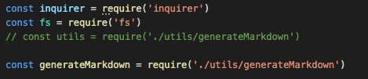
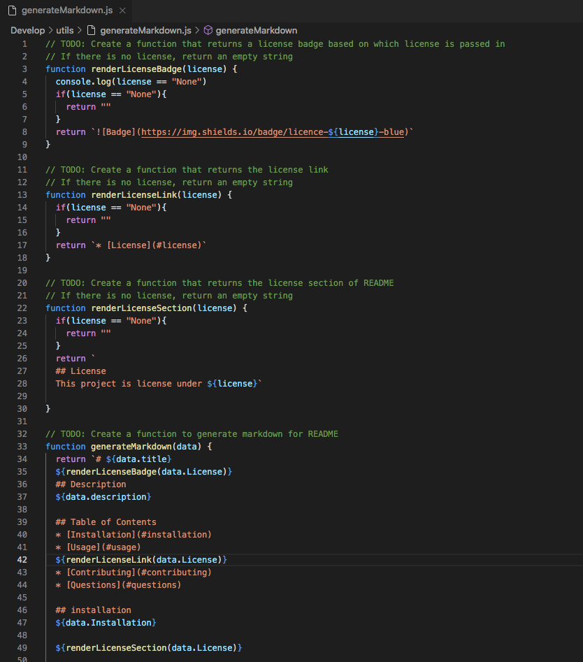
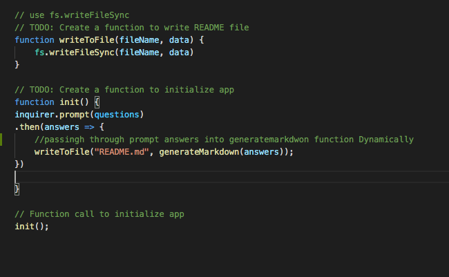

# Professional README Generator Starter Code

## Link to video:
https://youtu.be/TuLSOPJvOiU

## Purpose: 
This assignment was to create a generated readme that the user can create with the help of node and the inquirer module. 

## Steps: 
1. I had to gain access to the library "inquirer", so in the terminal i used the command npm install inquirer. Then in my code i had to make a const variable that looked like this"

     

     I also had to use const fs = require("fs") to gain access to Node's file system.

2. created a const questions function nesting an array of objects holding all of questions related to README.nd. 

3. Then went  in generateMarkdown.s file to dynamically generate the question data into README markdown. Then README's markdown was created using template literals to achieve the dynamic output. 

4. Created functions with if() statements if a user chooses a license or not. If the user chose a license the license's badge, link, and section would be called into the renderLicense Section. if a license was not picked it would return an empty "" string. Here is a screenshot of the process of all of that: 

    

    Notice how the i nested the rendeLicnese... Functions into the ${} so they are being called and display whatever the user picks as a license.

5. Lastly I created the init function to be the first thing to run when i initiate the app. The init() function accesses the .prompt(answers) of the question prompt i wrote above, passes through those answers using .then method into the writetoFile method. The writetofile has the file "README.md, which is the file it wants to generate, and as for the second paramater i pass through the prompt answers into the generateMarkdown function in the seperate js file. Here is how the function looks: 

    

## Link(s) that helped me:
https://shields.io/category/

## More Resources
[How to create a Professional README](https://coding-boot-camp.github.io/full-stack/github/professional-readme-guide)
